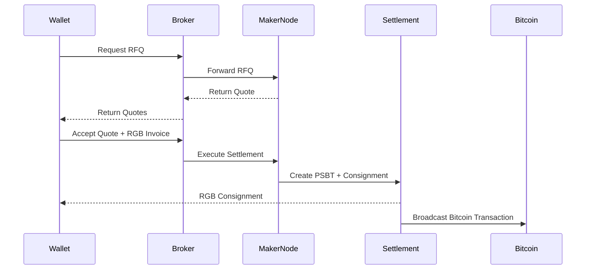

# RGB RFQ Network

Open-source RFQ infrastructure for RGB20 assets on Bitcoin.

## Overview

RGB RFQ Network is a request-for-quote coordination layer designed specifically for RGB client-side validation and UTXO-bound assets.

The goal is not to build a closed exchange, but reusable infrastructure for wallets, liquidity providers, and RGB applications that need access to RGB20 liquidity.

## Problem

RGB assets do not behave like EVM tokens.

There is no global token balance, no public contract state, and no simple on-chain `transferFrom` flow. RGB transfers require:

- receiver-generated invoices
- blinded UTXO seals
- sender-side PSBT construction
- RGB state transitions
- consignments
- client-side validation

This makes traditional orderbook and matching-engine architectures a poor first fit.

The ecosystem needs an open RFQ layer that understands RGB-native constraints.

## Proposed Solution

RGB RFQ Network provides:

- RFQ API for wallets and applications
- maker node architecture for liquidity providers
- quote routing and maker fanout
- reservation-aware inventory management
- public client SDK
- wallet abstraction layer
- RGB integration boundary
- future WASM/browser wallet support

## Architecture

