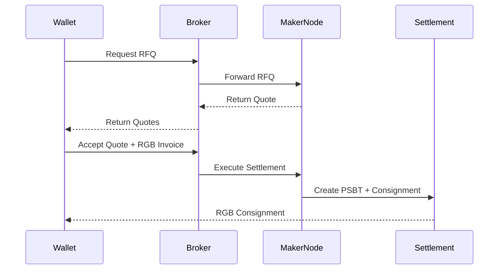

# RGB RFQ Network

Open-source RFQ infrastructure for RGB20 assets on Bitcoin.

## Summary

RGB RFQ Network is a request-for-quote coordination layer for RGB client-side validated assets. It provides a neutral protocol surface that wallets, liquidity providers, and RGB-native applications can use to discover quotes and settle RGB20 transfers without relying on a custodial venue.

This repository describes the proposal: scope, architecture, and milestones. The implementation is a modular Rust workspace, designed to be reusable as infrastructure rather than operated as a single product.

## Problem

RGB assets do not behave like EVM tokens. There is no global token balance, no public contract state, and no `transferFrom` primitive. An RGB20 transfer requires:

- a receiver-generated invoice with a blinded UTXO seal
- sender-side PSBT construction
- an RGB state transition
- a consignment delivered off-chain to the receiver
- client-side validation by the receiver

These constraints make traditional orderbook and matching-engine designs a poor first fit. There is no shared mempool of RGB orders, no way to passively "rest" liquidity against a public book, and no settlement path that does not involve direct PSBT and consignment exchange between counterparties.

The ecosystem needs an open coordination layer that respects these constraints instead of abstracting them away.

## Proposed Solution

RGB RFQ Network provides an RFQ-based coordination protocol with three components:

- **Broker** — receives RFQs from wallets, fans out to maker nodes, returns quotes.
- **Maker node** — runs by liquidity providers, manages reservation-aware UTXO inventory, signs PSBTs, produces consignments.
- **Client SDK** — wallet-facing library for requesting quotes, submitting RGB invoices, and receiving consignments.

The system is non-custodial. The broker never holds keys, RGB state, or user funds. Settlement is a direct PSBT-and-consignment exchange between maker and taker, coordinated through the broker.

Design constraints:

- open-source infrastructure focus, not a custodial exchange
- designed specifically for RGB20 assets and their UTXO-bound semantics
- modular Rust architecture, suitable for embedding into other RGB stacks
- future wallet and WASM/browser support as a first-class target

## Architecture Overview

The broker is a stateless coordinator. State lives at the edges: maker nodes hold UTXO inventory and RGB stash; wallets hold seals and consignments. This keeps the trust model narrow — a malicious or offline broker can deny service but cannot move assets or forge state.

See [docs/architecture.md](docs/architecture.md) for the full architecture, including RGB-native constraints, maker node internals, and the rationale for choosing RFQ over an orderbook at this stage.

## RFQ Flow

## Current Status

- RFQ protocol surface and broker scaffolding in progress
- Maker node inventory and reservation model under design
- RGB integration boundary defined against the current RGB v0.11 interfaces
- Repository is a proposal; implementation modules will land under this organization as milestones complete

## Roadmap

Detailed scope, deliverables, and timelines are in [docs/milestones.md](docs/milestones.md).

- **Milestone 1** — RFQ infrastructure: broker, protocol, client SDK
- **Milestone 2** — RGB settlement integration: PSBT construction, consignment delivery, end-to-end transfer
- **Milestone 3** — Wallet and WASM support: browser-embeddable client, wallet integration surface
- **Milestone 4** — Advanced routing: multi-maker fanout strategies, reservation-aware quoting, partial fills

## Open-Source Commitment

All components produced under this proposal are released under the MIT license (see [LICENSE](LICENSE)). Specifications, protocol messages, and reference implementations are developed in public. The goal is reusable infrastructure for the RGB ecosystem — wallets, custodians, and applications should be able to integrate or fork without negotiation.
