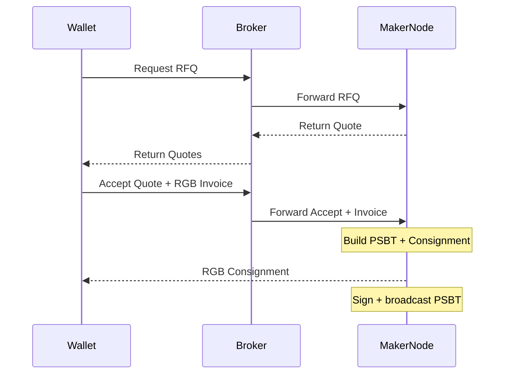

# RGB RFQ Network

Open-source coordination infrastructure for RGB20 assets on Bitcoin.

RGB RFQ Network is a request-for-quote protocol — broker, maker node, client SDK — that lets wallets and liquidity providers discover quotes and settle RGB20 transfers without a custodial venue. The system is non-custodial: a stateless broker routes RFQs, and settlement is a direct PSBT-and-consignment exchange between maker and taker.

The implementation is a modular Rust workspace, designed to be reusable as infrastructure rather than operated as a single product. This repository holds the protocol specification, architecture, milestone scope, and threat model; the workspace lives at [github.com/pxr64/rfq](https://github.com/pxr64/rfq), currently scaffolded with mocks (real RGB integration is tracked under Milestone 2).

## Motivation

RGB assets do not behave like EVM tokens. There is no global token balance, no public contract state, and no `transferFrom` primitive. An RGB20 transfer requires:

- a receiver-generated invoice with a blinded UTXO seal
- sender-side PSBT construction
- an RGB state transition
- a consignment delivered off-chain to the receiver
- client-side validation by the receiver

These constraints make traditional orderbook and matching-engine designs a poor first fit. There is no shared mempool of RGB orders, no way to passively "rest" liquidity against a public book, and no settlement path that does not involve direct PSBT and consignment exchange between counterparties.

The ecosystem needs an open coordination layer that respects these constraints instead of abstracting them away.

## Proposed Solution

RGB RFQ Network provides an RFQ-based coordination protocol with three components:

- **Broker** — receives RFQs from wallets, fans out to maker nodes, returns quotes.
- **Maker node** — run by liquidity providers, manages reservation-aware UTXO inventory, signs PSBTs, produces consignments.
- **Client SDK** — wallet-facing library for requesting quotes, submitting RGB invoices, and receiving consignments.

The broker never holds keys, RGB state, or user funds. Settlement is a direct PSBT-and-consignment exchange between maker and taker, coordinated through the broker.

Design constraints:

- open-source infrastructure focus, not a custodial exchange
- designed specifically for RGB20 assets and their UTXO-bound semantics
- modular Rust architecture, suitable for embedding into other RGB stacks
- wallet and WASM/browser support as a first-class target

## Architecture Overview

The broker is a coordinator with no persistent state. It routes RFQ, quote, and accept messages between wallets and maker nodes, holding only ephemeral in-flight routing state for the duration of an RFQ. State lives at the edges: maker nodes hold UTXO inventory and RGB stash; wallets hold seals and consignments. This keeps the trust model narrow — a malicious or offline broker can deny service but cannot move assets or forge state.

Full architecture — RGB-native constraints, settlement scope, maker node internals, privacy properties, and the rationale for choosing RFQ over an orderbook — is in [docs/architecture.md](docs/architecture.md). A protocol-level threat model is in [docs/threat-model.md](docs/threat-model.md).

## Settlement Scope

V1 targets **on-chain RGB20 settlement only**, built on the [rgb-lib](https://github.com/RGB-Tools/rgb-lib) v0.11 stash and state-transition APIs. Lightning RGB settlement (via [rgb-lightning-node](https://github.com/RGB-Tools/rgb-lightning-node)) is documented as future work and is out of scope for v1. The on-chain path matches the wallet-to-LP, lending, and OTC flows the ecosystem needs today; Lightning RGB integration is best added once on-chain settlement is hardened and rgb-lightning-node has stabilized further.

## Scope of Work

The work is organized as three milestones across ~6 months.

| Milestone | Description | Estimate |
|-----------|-------------|----------|
| M1 | RFQ infrastructure: broker, protocol specification, client SDK, maker skeleton | 8–10 weeks |
| M2 | RGB settlement integration: PSBT construction, consignment delivery, end-to-end signet transfers | 10–12 weeks |
| M3 | Wallet/WASM support: WASM client build, TypeScript bindings, third-party wallet integration | 6–8 weeks |

Each milestone has quantified success criteria — performance, correctness, and integration thresholds — defined in [docs/milestones.md](docs/milestones.md).

Items intentionally out of scope at this stage — multi-maker routing and partial fills, Lightning RGB settlement, RGB21/25 schemas — are documented under Future Work in the milestones doc.

## Relationship to Existing Work

The closest existing project is Kaleidoswap, which is building an end-user trading product for RGB assets. RGB RFQ Network is positioned a layer below: open-source coordination infrastructure (RFQ protocol, broker, client SDK, maker node) intended to be embedded into wallets, lending platforms, OTC desks, and trading products — including, potentially, products like Kaleidoswap themselves.

The system is not a venue, an exchange, or a custodian. It is the protocol surface and reference implementation that lets the RGB ecosystem coordinate quotes and settle transfers without each integrator rebuilding the same plumbing.

It builds on the canonical RGB stack — rgb-lib for stash and state-transition APIs, with rgb-lightning-node as the integration target for future Lightning settlement — and contributes specifications and reference code where the stack is currently under-specified (RFQ messaging, reservation-aware UTXO inventory, multi-maker routing). It does not fork existing components.

## License

MIT (see [LICENSE](LICENSE)). Specifications, protocol messages, and reference implementations are developed in public. The intent is reusable infrastructure for the RGB ecosystem — wallets, custodians, and applications should be able to integrate or fork without negotiation.

For technical discussion, open an issue on this repository.
