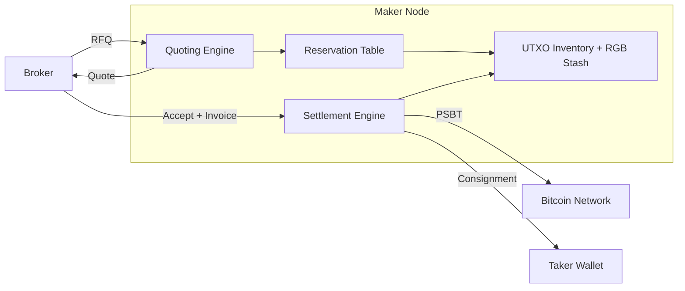

# Architecture

This document describes the architecture of RGB RFQ Network: the RGB-native constraints it is designed around, the maker node internals, and the rationale for choosing an RFQ model over an orderbook at this stage.

## RGB-Native Constraints

RGB is a client-side validation protocol. Asset state is not held on-chain or in a global ledger; it lives in per-user stashes and is validated by recipients against the consignment they receive. Any settlement layer for RGB must respect this model rather than work around it.

### UTXO-Bound Liquidity

RGB20 balances are bound to specific Bitcoin UTXOs. A maker holding `N` units of an asset does not hold a fungible pool — it holds a set of UTXOs, each carrying an allocation. Quoting and settlement must reason at the UTXO level:

- a quote implicitly commits a specific UTXO (or set of UTXOs) to a potential trade
- two concurrent quotes against overlapping UTXOs cannot both settle independently (combining them into a single transaction is technically possible but is an explicit routing decision, not a default)
- inventory state is the set of `(outpoint, asset_id, allocation)` tuples, not a scalar balance

This forces the maker node to track reservations per UTXO and to release them on quote expiry or rejection.

### Blinded UTXO Invoices

The receiver generates an RGB invoice that contains a blinded seal — a commitment to a UTXO that the sender cannot see. The sender constructs a PSBT and an RGB state transition that pays into that blinded seal without learning which UTXO it refers to.

The broker never sees an unblinded UTXO. The taker's privacy boundary is preserved end-to-end: the maker only learns the blinded seal at settlement time, and the broker only relays opaque invoice payloads.

### Consignments and Client-Side Validation

A successful RGB transfer produces two artifacts:

- a Bitcoin transaction (the PSBT, once signed and broadcast) that anchors the state transition
- a consignment, an off-chain bundle containing the state transition history the receiver needs to validate the new allocation

The receiver validates the consignment against its own RGB stash. If validation fails, the receiver does not credit the asset, regardless of what happened on-chain. This means consignment delivery is part of settlement, not a post-settlement step. The maker node is responsible for producing the consignment and ensuring it reaches the taker.

This ordering matters operationally. If consignment delivery fails *after* the PSBT has been broadcast, the chain has advanced but the receiver cannot validate the new allocation — funds are not lost (the maker can re-deliver the consignment) but the receiver is in a stuck state until delivery succeeds. The maker node must therefore complete consignment delivery before broadcasting whenever possible, and any delivery transport must be retriable for cases where re-delivery is the only remaining option.

## Settlement Scope

V1 of RGB RFQ Network targets **on-chain RGB20 settlement only**, built on the [rgb-lib](https://github.com/RGB-Tools/rgb-lib) v0.11 stash and state-transition APIs. Lightning RGB settlement, via [rgb-lightning-node](https://github.com/RGB-Tools/rgb-lightning-node), is documented as future work in [milestones.md](milestones.md) and is not part of the funded grant scope.

The on-chain-first decision is deliberate:

- Wallet-to-LP, lending, and OTC flows that the RGB ecosystem needs today are on-chain. These are the integrations the protocol must serve in v1.
- Lightning RGB is still maturing. rgb-lightning-node has its own evolving channel and HTLC semantics; coupling v1 settlement to that surface would import that flux into the broker and client SDK.
- A narrower v1 scope keeps the trust model and the threat surface small enough to ship and audit within the grant window.

The architecture is shaped to make a Lightning adapter an addition rather than a rewrite. The settlement engine inside the maker node is a trait boundary; the on-chain implementation is one realization of that trait, and a Lightning realization can be added later without touching the broker, the client SDK, or the protocol surface.

## Maker Node Architecture

A maker node is a self-contained service operated by a liquidity provider. It owns:

- a Bitcoin wallet (UTXOs, signing keys)
- an RGB stash (state transitions, allocations)
- a reservation table (UTXOs held for in-flight quotes)
- a quoting policy (pricing, expiry, size limits)
- a settlement engine (PSBT construction, consignment generation)

### Reservation-Aware Inventory

When the quoting engine produces a quote, it places a soft reservation on the UTXOs that would be consumed if the quote is accepted. Reservations:

- are scoped to a single quote ID
- expire when the quote expires
- are released on explicit rejection or timeout
- block other quotes from committing to the same UTXOs

This prevents the common failure mode where a maker hands out two quotes against the same inventory and can only honor one. Reservations are local state — they are not synchronized across maker nodes, since each maker controls its own UTXO set. Cross-maker reservation state is never shared; any future broker-side coordination (Milestone 4) operates on broker-held fanout hints, not on maker-internal reservation tables.

### Settlement Engine

On quote acceptance, the settlement engine:

1. consumes the reservation
2. parses the RGB invoice (blinded seal, asset ID, amount)
3. constructs a PSBT spending the reserved UTXOs
4. builds the RGB state transition assigning the allocation to the blinded seal
5. produces the consignment
6. delivers the consignment to the taker
7. signs and broadcasts the PSBT

Consignment delivery precedes broadcast. If delivery fails, the maker can abort before committing the Bitcoin transaction, avoiding the case where the chain advances but the receiver cannot validate.

## Privacy Properties

The system is designed so that the broker sees only the minimum needed to route an RFQ, and the on-chain footprint of a settled trade carries no asset semantics for an external observer.

| Field | Broker | Maker | External (chain/network) observer |
|---|---|---|---|
| RFQ payload (asset ID, amount, side) | Sees — required to route | Sees — required to quote | Does not see |
| Taker network identity | Pseudonymous session ID only | Not directly visible (broker-mediated) | Does not see |
| Taker UTXO (the unblinded outpoint) | Does not see (blinded by invoice) | Does not see — only the blinded seal commitment | Does not see |
| Maker source UTXOs | Not in any protocol message — the PSBT is built, signed, and broadcast directly by the maker, not relayed through the broker. Timing correlation against on-chain activity remains a residual leak. | Self | Sees on-chain after broadcast (as ordinary Bitcoin inputs) |
| Consignment payload | Does not see (delivered out-of-band by direct transport) | Produces it | Does not see |
| Post-settlement linkability | Knows that RFQ X led to acceptance Y | Knows its own counterparty for that trade | Sees a Bitcoin transaction; cannot determine it carried RGB state without out-of-band information |

Two consequences worth flagging:

- **A malicious broker is bounded.** A broker cannot move assets, forge state, or learn the taker's UTXO. It can deny service, log RFQs, and observe routing patterns. The protocol does not assume a single broker; multiple independent brokers can coexist.
- **Maker selection is the taker's privacy decision.** Choosing which maker to trade with reveals the taker's blinded seal to that maker at settlement. Takers should treat maker selection the same way they treat counterparty selection in any direct trade.

A more complete threat model is in [threat-model.md](threat-model.md).

## Why RFQ Fits RGB Better Than Orderbooks Initially

A central limit orderbook assumes resting liquidity, fungible inventory, and a matching engine that can pair any bid with any ask. None of these hold cleanly for RGB:

- **No resting liquidity surface.** An order on a public book would need to commit a UTXO publicly, leaking which output is being offered and burning the maker's privacy. RFQ keeps quoting private and pairwise.
- **Inventory is not fungible.** Two UTXOs holding the same asset are not interchangeable from the maker's perspective — they have different sizes, different histories, and different reservation states. Quoting per-RFQ lets the maker pick the right UTXO for the request.
- **Settlement is interactive.** RGB settlement requires invoice exchange, PSBT construction, and consignment delivery between specific counterparties. An orderbook abstracts counterparties away; RFQ keeps the pair explicit, which matches the protocol shape.
- **No partial-fill semantics by default.** Splitting an RGB allocation across multiple makers requires coordinated state transitions or sequential fills. RFQ makes this an explicit routing decision rather than an implicit matching outcome.

An orderbook may become viable later — for example, once routing across multiple makers and partial fills are standardized (Milestone 4). RFQ is the lower-risk starting point that respects RGB's constraints today.
